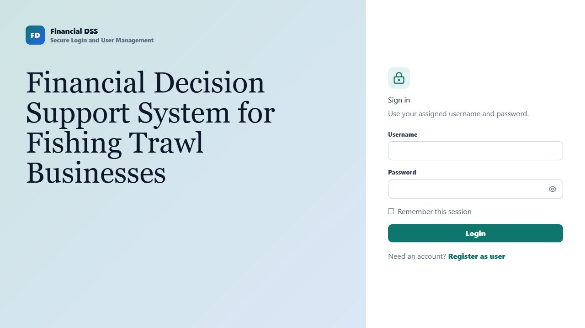
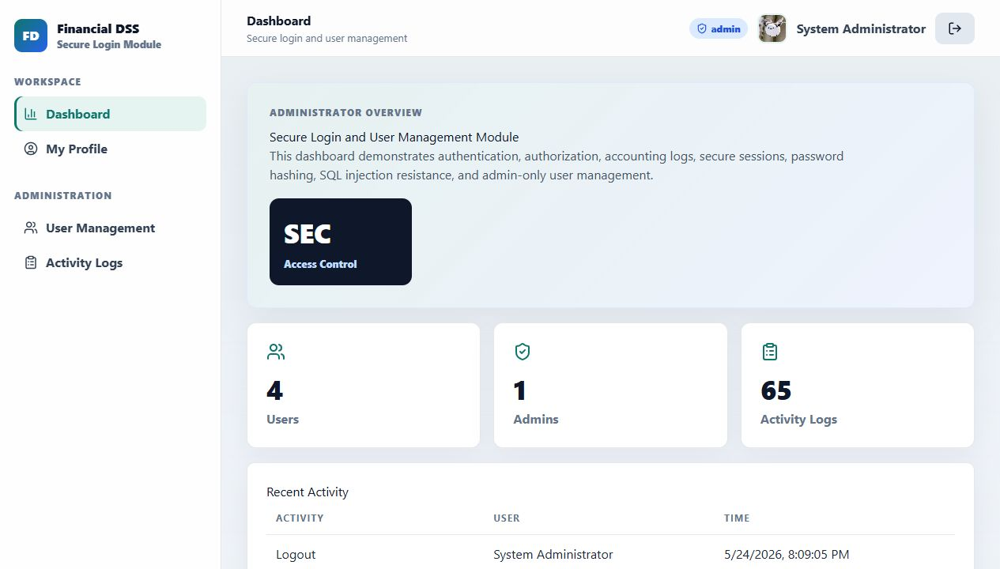
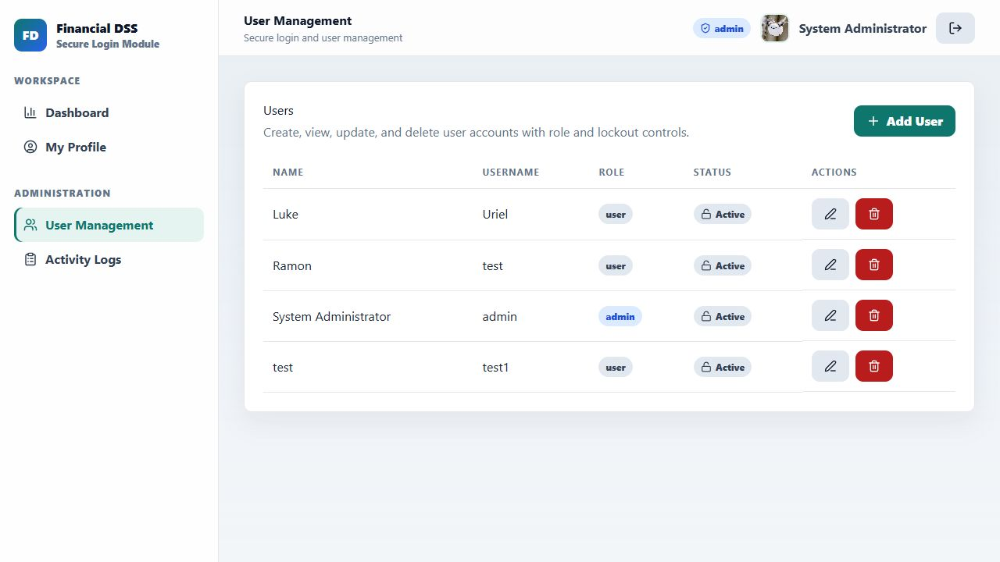
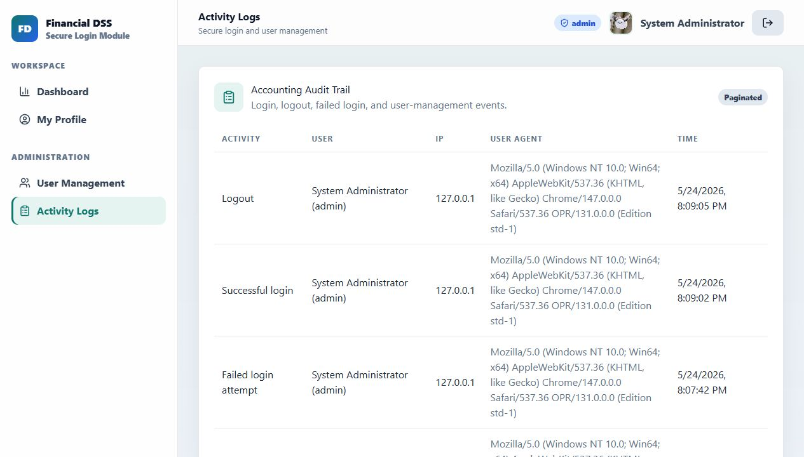
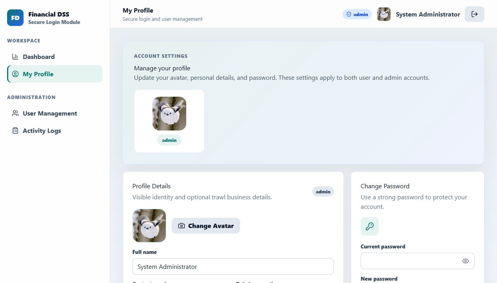

# Cantil Trawl Finance

## Secure Login and User Management Module

This website is a Laravel + React/Inertia system created for the IT-10 Secure Login and User Management project. It protects access through authentication, role-based authorization, account lockout for users, password hashing, activity logging, session timeout, and admin-only user management.

## Main Features

- Secure login and registration
- Hashed passwords using Laravel hashing
- SQL injection resistant authentication through Laravel validation and Eloquent
- Login attempt limit and account lockout for normal users
- Admin accounts protected from lockout
- Role-based access control for `admin` and `user`
- Admin user CRUD with create, edit, delete, and lock controls
- Activity logs for login, logout, failed login, user actions, and session timeout
- User profile management with avatar, personal details, and password change
- Pagination for user management and activity logs
- Logout confirmation and inactivity timeout

## 1. Login Page

The login page accepts an assigned username and password. If login fails, the system gives a safe generic error. If too many attempts occur, it shows a proper retry-time message.



Security shown here:

- Password field is hidden by default
- Login inputs are validated
- Failed logins do not reveal whether the username exists
- Too many attempts are handled with a clear error message

## 2. Dashboard

After login, users are redirected to the dashboard. Admin users see a security overview and recent activity. Normal users only see user-side dashboard content.



Security shown here:

- Dashboard is protected by authentication
- Admin and user views are separated by role
- Recent security activity is visible for monitoring

## 3. User Management

Only admins can access User Management. Admins can create, edit, and delete users through modals. Password rules and confirm password fields help prevent weak or mistyped passwords.



Security shown here:

- Admin-only CRUD
- Role selection for `admin` and `user`
- Lockout controls for normal users
- Admin accounts cannot be locked
- Passwords are never stored as plain text
- Pagination keeps the table organized

## 4. Activity Logs

The Activity Logs page records important security events. This helps the admin audit what happened in the system.



Logged events include:

- Successful login
- Failed login attempt
- Rate-limited login attempt
- Logout
- User created
- User updated
- User deleted
- Session timeout due to inactivity

## 5. Profile Management

Users and admins can update their own profile details, upload an avatar, and change their password.



Security shown here:

- Users can only edit their own profile
- Password change requires the current password
- New password must follow strength rules
- Uploaded avatars are validated as image files
- Missing avatar files safely fall back to an icon or initials

## Security Test Summary

The project includes automated Laravel tests for the main security requirements.

Run this command in VS Code terminal:

```powershell
php artisan test
```

Expected result:

```text
23 passed
```

The tests verify:

- Valid admin login succeeds
- Invalid login fails
- SQL injection does not bypass login
- User registration works
- Passwords are hashed
- Normal users cannot access admin pages
- Admin CRUD works
- Locked normal users cannot log in
- Admin accounts are protected from lockout
- Rate-limited login returns a retry-time message
- Logout creates an activity log
- Inactivity timeout logs out the user
- User and log pages are paginated

## How to Run

Start the Laravel server:

```powershell
php artisan serve
```

Open:

```text
http://127.0.0.1:8000
```

If frontend files were changed, rebuild assets:

```powershell
npm.cmd run build
```

Default admin account:

```text
Username: admin
Password: Admin@12345
```

## Short Presentation Script

This system demonstrates a secure login and user management module. It uses Laravel authentication, hashed passwords, role-based access control, account lockout for normal users, admin-only CRUD, activity logs, session timeout, and validation against SQL injection. The admin can manage users and audit system activity, while normal users only access their own dashboard and profile.
